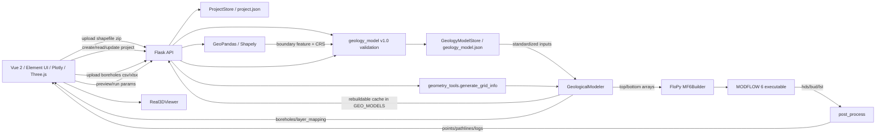
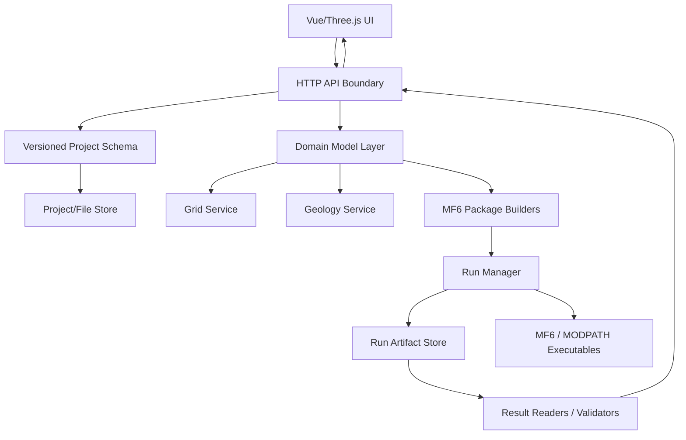

# Current Architecture

本文描述当前代码事实，不描述目标架构。任何未在代码中确认的内容均标记为“需要验证”。

## 当前组件

## 文件上传数据流

### 边界 Shapefile

1. `BoundaryMap.vue` 使用 `el-upload` 调用 `POST /upload-shapefile`。
2. `app.py` 调用 `parse_boundary_shapefile_zip(file)`。
3. `geometry_utils.py` 保存 ZIP 到临时目录，解压后读取第一个 `.shp`。
4. 检查 ZIP 路径穿越和大小限制，读取 Shapefile CRS。
5. CRS 缺失或与项目 CRS 冲突时拒绝。
6. 支持 `Polygon`、`MultiPolygon`、闭合 `LineString`。
7. 边界写入标准化 `geology_model.boundary` 并持久化。
8. `App.vue` 存入外环坐标和 normalized geology model，并通知 `BoundaryMap` 绘图。

限制：

- 未处理内洞。
- `MultiPolygon` 只取第一个 polygon。
- 只读取第一个 `.shp` 和第一条 geometry。

### 钻孔和地层

1. `LayerPanel.vue` 选择 CSV/XLSX 后调用 `POST /upload-boreholes`。
2. `GeologicalModeler` 读取表格。
3. `preprocess_data()` 读取 `钻孔名称`、`X`、`Y`、`Z`、`分层ID`、`Top/Bottom` 或 `分层厚度`。
4. 如果没有 Top/Bottom，则用 `Z - 累积厚度` 推算。
5. 后端要求显式 `project_id` 且项目必须存在。
6. 上传数据转换为标准化 `boreholes` 和 `stratigraphy.formations`。
7. `GeologyModelService` 验证、持久化 `geology_model.json`，并更新 `GEO_MODELS[project_id]` 可重建缓存。
8. 前端保存后端返回的 normalized geology model；`rawCsvContent` 只作为 legacy 迁移输入。

限制：

- 已有 schema 校验和 diagnostics，但 CSV/XLSX 列名兼容范围仍有限。
- 钻孔 CSV/XLSX 没有文件级 CRS 元数据，当前按项目 CRS 和用户声明解释。
- 地层派生面数组当前不持久化为 `.npz`，而是从标准化输入重建。

### 断层

1. `BoundaryMap.vue` 调用 `POST /upload-faults`。
2. `app.py` 用 pandas 读取 CSV/XLSX。
3. 按 `断层编号` 或 `Fault_ID` 分组，并读取 `X`、`Y`。
4. 转换为标准化 `faults`，持久化到 geology model，并返回断层折线数组。
5. `GeologicalModeler.interpolate_surfaces()` 用断层线延长后切割域 polygon，并在每个断块内单独插值。

限制：

- 断层没有进入 MODFLOW 6 HFB、DISV/DISU 或任何水力边界 package。
- 当前断层只影响地层插值分块。
- 没有断距、倾角、导水/阻水属性、垂向几何。
- API 会返回 `FAULT_NOT_HFB` warning，避免把当前断层误认成 MODFLOW HFB 或水力屏障。

### RCH/EVT 分区

后端存在 `POST /upload-zone`，读取面状 Shapefile 并返回 `coords` 和 `value`。  
前端 `RchEvtManager.vue` 调用的是 `POST /upload-scatter`，该接口不存在。

因此当前 UI 的“导入散点数据”不能进入后端模型。后端 `run_simulation()` 虽然接受 `rch_data` 和 `evt_data`，但期望的是面分区 `coords/value`，不是散点 `x/y/value`。

## 网格数据流

1. 前端 `GridSettings.vue` 设置 X/Y 的尺寸或数量。
2. `App.vue` 调用 `/preview-geometry` 或 `/run-model`。
3. `geometry_tools.generate_grid_info()`：
   - 由边界 polygon 的 bounds 计算 `nrow/ncol/delr/delc`。
   - 由单元中心是否在 polygon 内生成 `active_2d`。
   - 生成插值用 `grid_x/grid_y`。
4. `get_grid_geometry()` 仅返回几何预览点，不运行 MODFLOW。
5. `run_simulation()` 将 `active_2d` 复制到所有层形成 `idomain`。

重要风险：

- 前端 `BoundaryMap.previewGrid()` 自己计算 2D 网格，并强制 `nrow/ncol >= 5`；后端没有这个强制最小值。前端点击得到的 `row/col` 可能和后端实际 DIS 网格不一致。
- `idomain` 在所有层完全相同，不考虑局部尖灭层的 inactive cell。
- 只支持结构化 DIS 网格。

## FloPy/MODFLOW 6 创建流程

`MF6Builder.initialize_sim()`：

- `MFSimulation(sim_name='sim', exe_name=<resolved MF6 executable>, sim_ws=work_dir)`
- `TDIS nper=1, perioddata=[(1.0, 1, 1.0)], time_units='DAYS'`
- `IMS complexity='COMPLEX'`
- `GWF save_flows=True, newtonoptions='NEWTON'`

`setup_dis()`：

- `ModflowGwfdis(length_units='METERS')`
- 使用插值后的 `top` 和 `botm`
- 使用 `idomain`
- 设置 `xorigin/yorigin`

`setup_npf()`：

- 全局 K 初始化为 `params.k`
- `k_cells` 可覆盖指定层或全层同一 row/col
- `ModflowGwfnpf(k=k_array, save_specific_discharge=True, icelltype=1)`

`setup_boundary_conditions()`：

- CHD：沿用户选择的边界线附近单元创建 `ModflowGwfchd`，只在 layer 0。
- RIV：沿边界线创建 `ModflowGwfriv`，stage 使用 UI 起终点插值，但 cond 固定为 `100`，rbot 固定为 `5`，只在 layer 0。
- DRN/GHB：列表变量存在，但没有创建 `ModflowGwfdrn` 或 `ModflowGwfghb`。
- WEL：按前端 row/col/layer/rate 创建 `ModflowGwfwel`。
- RCH：当 `rch_array > 0` 时创建 `ModflowGwfrcha`。
- EVT：当 `evt_array > 0` 时创建 `ModflowGwfevta(surface=top_layer, rate=evt_array, depth=2.0)`。
- OC：保存全部 head 和 budget。

## MODFLOW 运行与结果

1. `run_simulation()` 为每次运行创建 `backend/workspace/{uuid8}`。
2. `builder.run()` 写入 FloPy 输入并执行 MODFLOW 6。
3. 成功后读取 `gwf.hds` 和 `gwf.bud`。
4. `post_process.process_results()`：
   - 读取 `HeadFile(...).get_data()`。
   - 从 budget 中尝试读取 `DATA-SPDIS` 或 `SPDIS`。
   - 以比流量和单元几何估算六面流量。
   - 返回每个活动单元的 `x/y/layer/row/col/top/bottom/head/flows`。
5. 运行结束后调用 `cleanup_run_workspace()`：失败默认保留，成功是否保留由配置控制。

限制：

- 不返回 `.nam/.dis/.npf/.lst/.hds/.bud` 的持久化引用。
- 不解析收敛状态、outer/inner iteration、percent discrepancy。
- 不提供全模型水量平衡。
- `shutil.rmtree(WORK_DIR)` 使失败复盘和标准回归测试困难。

## MODPATH 当前流程

后端：

- `MF6Builder.run_modpath(start_points)` 创建 `Modpath7`、`ParticleData`、`ParticleGroup`、`Modpath7Bas` 和 `Modpath7Sim`。
- `MP7_EXE_PATH` 硬编码为 `G:\workspace\flopy-project\modpath7\bin\mpath7.exe`。

前端：

- `CellDetailPanel.vue` 有“从该点追踪流线”按钮，发出 `trace-particle`。
- `App.vue` 监听 `Real3DViewer` 的 `@trace-particle`。
- 但 `Real3DViewer.vue` 没有监听 `CellDetailPanel` 的 `trace-particle` 并向上转发。

结论：粒子追踪后端有部分实现，但当前 UI 触发链路不完整；MODPATH 运行还受硬编码路径影响。

## Three.js 显示数据流

1. `App.vue` 收到 `/preview-geometry` 或 `/run-model` 的 `points`。
2. `Real3DViewer.vue` 监听 `points` 并调用 `drawVoxels()`。
3. 每个 layer 使用一个 `THREE.InstancedMesh`。
4. 网格中心坐标转换为：
   - X：`p.x - cx`
   - Y：`centerZ * zScale`
   - Z：`-(p.y - cy)`
5. 水头存在时按 HSL 颜色映射；否则按 layer 颜色。
6. `drawBoreholes()` 绘制钻孔柱。
7. `updateFlowVectors()` 根据 `flows` 重算箭头方向。
8. `AnalysisPanel.vue` 用 Plotly 绘制等值线和剖面。

显示限制：

- 结果显示和网格生成没有统一的模型坐标元数据对象。
- RCH/EVT 3D 等值线开关的 props 没有从 `App.vue` 传入 `Real3DViewer`。
- 单元六面流量和流向箭头是后处理推导值，不等同于正式水量平衡报告。

## 当前 API 表

| API | 前端接入 | 后端实现 | 状态 |
|---|---:|---:|---|
| `POST /projects/validate` | 间接 | 是 | 校验完整 Project Schema |
| `POST /projects` | 是 | 是 | 创建项目并返回稳定 `project_id` |
| `GET /projects/<project_id>` | 否 | 是 | 后端可读取项目定义 |
| `PUT /projects/<project_id>` | 是 | 是 | 更新项目元数据/CRS/单位 |
| `POST /projects/<project_id>/geology-models/validate` | 是 | 是 | 验证并返回 normalized geology model，不持久化 |
| `POST /projects/<project_id>/geology-models` | 是 | 是 | 创建 active geology model 并更新 project reference |
| `GET /projects/<project_id>/geology-models/active` | 间接 | 是 | 读取持久化 active geology model |
| `PUT /projects/<project_id>/geology-models/<geology_model_id>` | 否 | 是 | 更新 active geology model |
| `POST /projects/<project_id>/geology-models/<geology_model_id>/rebuild` | 否 | 是 | 从持久化标准输入重建 `GEO_MODELS` 缓存 |
| `POST /upload-boreholes` | 是 | 是 | 兼容入口；调用统一 geology service |
| `POST /upload-faults` | 是 | 是 | 兼容入口；断层只影响插值 |
| `POST /upload-shapefile` | 是 | 是 | 兼容入口；检查 ZIP 安全和 Shapefile CRS |
| `POST /upload-zone` | 否 | 是 | 后端已实现但 UI 未接入 |
| `POST /upload-scatter` | 是 | 否 | UI 已存在但后端未实现 |
| `POST /preview-geometry` | 是 | 是 | 可用；缓存缺失时从 active geology model 重建 |
| `POST /run-model` | 是 | 是 | 可用；缓存缺失时从 active geology model 重建，数值验收不足 |
| `POST /export-model` | 是 | 是 | 可用，OBJ 网格尺寸由点分布推断 |

## 状态存储

| 状态 | 位置 | 风险 |
|---|---|---|
| 项目定义 | `backend/projects/<project_id>/project.json` | 已持久化；仍无数据库/权限系统 |
| 地质模型标准数据 | `backend/projects/<project_id>/geology/geology_model.json` | active geology model 已持久化；派生面数组仍采用可重建策略 |
| 钻孔地质模型缓存 | Flask 全局 `GEO_MODELS[project_id]` | 项目间隔离；可由持久化 geology model 重建 |
| 井、K、RCH/EVT 和边界条件 | `App.vue` 内存和前端项目包 | 刷新后可由项目包恢复；正式 Flow schema 待实现 |
| 运行输入/输出 | `backend/workspace/<run-id>` | 失败默认保留；成功保留可配置；正式 run history 待实现 |
| 前端项目文件 | 浏览器下载 `modflow_project_bundle` JSON | 新格式包含 `project`、`geology_model` 和流场 UI state |
| MF6/MODPATH 可执行路径 | `mf6_executable.py` / `mf6_wrapper.py` | MF6 已统一解析；MODPATH 仍是后续技术债 |

## Recommended Target Architecture

本节是推荐目标架构，不代表当前代码已经实现，也不是本轮重构范围。

推荐分层：

- API 层：只负责认证、请求校验、错误格式、文件上传下载，不直接拼 FloPy package。
- Project schema 层：定义版本化项目数据结构，包括 CRS、单位、网格、地层、边界、packages、运行设置。
- Domain model 层：用明确的数据类表达 `Boundary`、`Grid`、`LayerSurface`、`StressPeriod`、`Well`、`RechargeZone` 等概念。
- Grid service：唯一负责生成网格和 cell id；前端只渲染后端返回的网格。
- Geology service：负责钻孔校验、地层面插值、断层/尖灭处理和地层诊断。
- Package builders：每个 MODFLOW 6 package 一个小的 builder 和测试，保证 UI 字段到 FloPy 字段可追踪。
- Run manager：负责运行目录、可执行文件自检、并发队列、运行取消、日志和 artifact 保存。
- Result readers/validators：读取 head、budget、listing、pathline，生成收敛和水量平衡验收结果。
- Frontend state：以 project/run id 为中心，避免把后端唯一状态藏在浏览器内存。

推荐数据对象边界：

- `Project`: metadata、unit system、CRS、source files、model config。
- `GridDefinition`: nlay/nrow/ncol、delr/delc、origin、idomain、cell ids。
- `GeologyModel`: boreholes、layer mapping、surfaces、interpolation diagnostics。
- `FlowPackageConfig`: CHD/RIV/DRN/GHB/WEL/RCH/EVT/STO/IC/OC/IMS。
- `RunRecord`: input hash、executable versions、workspace path、status、logs、result summary。
- `ResultDataset`: head arrays、budget summaries、cell vectors、derived visual layers。

迁移原则：

- 不一次性重写当前原型。
- 先围绕一个最小 steady-flow benchmark 抽出 project/run/artifact 概念。
- 每迁移一个 package，就增加对应 schema、API、FloPy 写入测试和数值基准。
- UI 中尚未实现的功能先禁用或显式标记，避免前端展示领先于数值实现。
