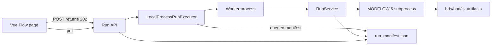

# Async Run Architecture

Date: 2026-07-13.

## Status Model

`run_manifest` schema version is now `1.1`. Version `1.0` manifests are migrated
by adding the `executor` object.

Active statuses:

- `created`
- `queued`
- `starting`
- `validating`
- `compiling`
- `writing_input`
- `running`
- `postprocessing`
- `cancel_requested`

Terminal statuses:

- `completed`
- `completed_with_warnings`
- `cancelled`
- `timed_out`
- `interrupted`
- `failed_validation`
- `failed_compile`
- `failed_executable`
- `failed_input_write`
- `failed_execution`
- `failed_convergence`
- `failed_outputs`
- `failed_budget`
- `failed_postprocessing`

## Cancel And Timeout

Cancel requests update the manifest to `cancel_requested`. The worker reloads the
manifest during phase boundaries and while MF6 is running. During MF6 execution,
the executor terminates the MF6 process tree, preserves generated artifacts, and
marks the run `cancelled`.

Timeout uses the same process-tree termination path and marks the run
`timed_out`.

## Restart Recovery

When the API process starts, existing non-terminal runs in worker-only statuses
are marked `interrupted`. Queued runs remain queued and can be scheduled by the
local executor.

## Windows Manifest Writes

Polling can briefly hold `run_manifest.json` open on Windows. Manifest writes use
atomic temp-file replacement with a short retry loop to avoid false run failures
from transient `PermissionError`.
