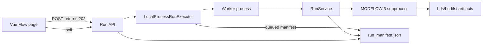

# Async Run Architecture

Date: 2026-07-13.



## Status Model

`run_manifest` schema version is now `1.2`. Version `1.0` and `1.1` manifests
are migrated by adding the expanded `executor` object and `resource_usage`.

Active statuses:

- `created`
- `queued`
- `starting`
- `validating`
- `compiling`
- `writing_input`
- `running`
- `postprocessing`
- `cancel_requested`

Terminal statuses:

- `completed`
- `completed_with_warnings`
- `cancelled`
- `timed_out`
- `interrupted`
- `interrupted_with_live_process`
- `failed_cancel`
- `failed_validation`
- `failed_compile`
- `failed_executable`
- `failed_input_write`
- `failed_execution`
- `failed_resource_limit`
- `failed_convergence`
- `failed_outputs`
- `failed_budget`
- `failed_postprocessing`

## Cancel And Timeout

Cancel requests update the manifest to `cancel_requested` and the executor now
actively terminates the recorded worker/MF6 process tree. During MF6 execution,
the worker also observes `cancel_requested` and uses the same termination helper.
The run is marked `cancelled` only after known process ids are gone; otherwise it
becomes `failed_cancel`.

Timeout uses the same process-tree termination path and marks the run
`timed_out`.

## Restart Recovery

When the executor starts, existing non-terminal runs are inspected with persisted
PID identities. Matching live worker/MF6 processes are terminated before the run
is marked `interrupted`, `cancelled`, or `interrupted_with_live_process`.
Queued runs remain queued and can be claimed later.

## SQLite Claim Store

`RunSchedulerStore` uses SQLite transactions for single-machine multi-process
claims. It stores scheduling state only. The atomic claim transition is:

```text
queued -> starting
```

Global and per-project concurrency limits are enforced inside that transaction.
Lease expiry allows stale claims to return to `queued`.

## Worker Mode

Development mode can keep embedded scheduling:

```bash
set FLOPY_EXECUTOR_MODE=embedded
python app.py
```

Dedicated worker mode:

```bash
set FLOPY_EXECUTOR_MODE=dedicated
python app.py
python -m run_worker
```

## Windows Manifest Writes

Polling can briefly hold `run_manifest.json` open on Windows. Manifest writes use
atomic temp-file replacement with a short retry loop to avoid false run failures
from transient `PermissionError`.
